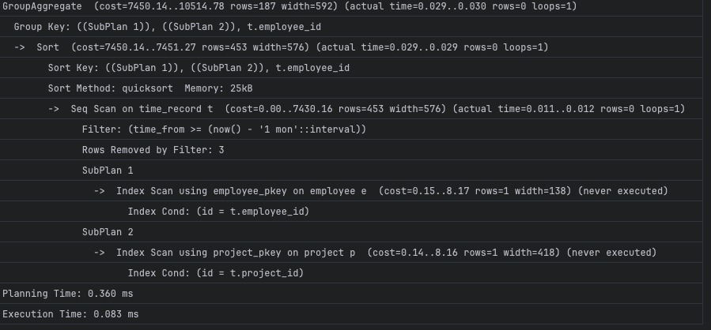

# XPHR Assignment

## 1. Database Query Optimization
### 1.1. Analyze the Query Performance
- Run EXPLAIN ANALYZE on the query

- Potential issues:
  - Sequential scan on time_record without indexing
  - Multiple nested subqueries
### 1.2. Optimization:
   - Index to help with filtering in WHERE clause, example:
     ```
     CREATE INDEX IF NOT EXISTS idx_time_record_time_from ON time_record(time_from);
     ```
   - Use merge joins to join tables
   - Optionally, create Materialized view, example:
     ```
     CREATE MATERIALIZED VIEW mv_monthly_hours AS
     SELECT
     tr.employee_id,
     e.name AS employee_name,
     p.name AS project_name,
     SUM(EXTRACT(EPOCH FROM (tr.time_to - tr.time_from)) / 3600) AS total_hours
     FROM time_record tr
     JOIN employee e ON tr.employee_id = e.id
     JOIN project p ON tr.project_id = p.id
     WHERE tr.time_from >= NOW() - INTERVAL '1 month'
     GROUP BY tr.employee_id, e.name, p.name;
     ```
### 1.3. Revised query:
```
SELECT
    tr.employee_id,
    e.name AS employee_name,
    p.name AS project_name,
    SUM(EXTRACT(EPOCH FROM (tr.time_to - tr.time_from)) / 3600) AS total_hours
FROM time_record tr
JOIN employee e ON tr.employee_id = e.id
JOIN project p ON tr.project_id = p.id
WHERE tr.time_from >= NOW() - INTERVAL '1 month'
GROUP BY tr.employee_id, e.name, p.name
ORDER BY e.name, p.name;
```
### 1.4. After optimization:
   - Index scan on time_record.time_from
   - Merge joins between time_record, employee, and project
   - Grouping and sorting are efficient due to direct column use

## 2. JSP-Based Reporting Page

The XPHR API contains following components:

| Component  | URL                                         | Description                | Language                                                                              |
|------------|---------------------------------------------|----------------------------|---------------------------------------------------------------------------------------|
| API        | http://localhost:8080                       | Electronic Store API.      | Java, Spring, JPA, Flyway, Lombok, Log4j2, Swagger, JUnit, Mokito, Checkstyle, Jacoco |
| Database   |                                             | Electronic Store Database. | Postgres                                                                              |
| Swagger UI | http://localhost:8080/swagger-ui/index.html | API documentation.         | HTML                                                                                  |

### 2.1. Directory structure

```plaintext
   project-root/
   ├── codequality                                      # Checkstyle configuration
   ├── gradle                                           # Gradle wrapper, manage library versions
   ├── libs                                             # external libraries
   └── src/
      ├── main/java/com/example/xphr/                 # Spring Boot application source files
      └── main/resources/
         ├── db/migration/                              # Flyway migration scripts
         ├── postman                                    # Postman collection
         └── application.properties                     # Spring Boot application configuration
         └── log4j2.xml                                 # Log4j2 configuration
      ├── main/webapp/                                  # JSP files
   ├── build.gradle                                     # Gradle build script
   ├── Dockerfile                                       # Dockerfile
   ├── docker-compose.yml                               # Docker Compose configuration
   └── README.md                                        # Project documentation
   ```

### 2.2. Installation

#### 2.2.1. Prerequisites

- JDK >= 17
- Docker
- Gradle >= 7.5

#### 2.2.2. Build

##### 2.2.2.1. Start project

```shell
  docker compose up --build -d
```

#### 2.2.2.2 Stop project

```shell
  docker compose down
```

### 2.3. Endpoint
Once the service is up, the following endpoint will be available:

| Endpoints         | Method | Type    | Description                        |
|-------------------|--------|---------|------------------------------------|
| /api/v1/report    | GET    | Private | To get system reports by user role |


- `Private` endpoints can only be accessed with a Header `X-USER-ID`.
- Based on Header `X-USER-ID`, the role of the user will be determined.
  - Default Admin role: `admin`
  - Default Employee roles: `ronaldo`, `messi`, `neymar`
- Example CURL request for Admin:
```shell
    curl --location 'http://localhost:8080/api/v1/report?startDate=2025-07-01T00%3A00%3A00&endDate=2025-07-30T23%3A59%3A59&size=3&page=0' \
    --header 'X-USER-ID: admin'
```
- Example CURL request for Employee:
```shell
    curl --location 'http://localhost:8080/api/v1/report?startDate=2025-07-01T00%3A00%3A00&endDate=2025-07-30T23%3A59%3A59&size=3&page=0' \
    --header 'X-USER-ID: ronaldo'
```